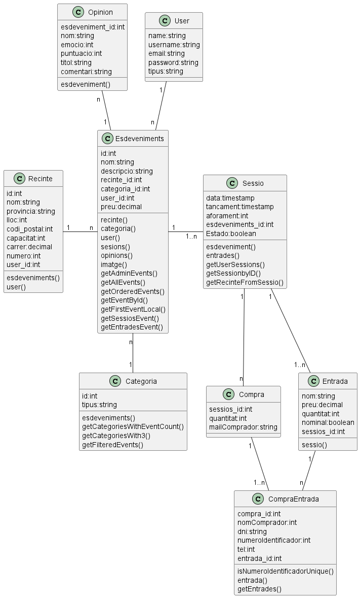

= ShowTickt: Memoria
:Author: Brian Tobias Arrua, Joan Galindo, Camilo Jumelle
:doctype: book
:encoding: utf-8
:lang: ca
:toc: right
:numbered:

== Introducción

Los miembros del proyecto somos Brian Tobias Arrua, Galindo Palacio Joan y Camilo Jumelle. Este proyecto tratará de realizar una aplicación que venderá entradas para eventos de varios
tipos, este proyecto incluye una sección de promotores donde el promotor deberá ir añadiendo y adminsitrando los eventos a vender.

== Diseño
    

=== Diagrama entitat relacio
**La siguiente imagen es el primer diseño de la base de datos**

image::images\BD\primerDiagrama.png[] 

**Esta imagen es un redieño del primer diagrama**

Hicimos este cambio principalmente por que en el primero no especificamos cual era la tabla fuerte y la tabla debil en "Esdeveniment, categoria y recinte"

image::images\BD\segonDiagrama.png[] 

**Este es el Diagrama Actualizado**

Añadimos las tablas de usuario, y colocamos bien sus atributos. 

image::images\BD\quartDiagrama.png[]

=== Diagrama per classes

**Este es el Diagrama Actualizado**

Añadimos las tablas de opinion para guarda las opiniones de los clientes y la de compra, Compra_Entradas

image::images\BD\UltimoDiagrama.png[]

=== Diagrama per classes

**Este es el diagrama definitivo de la base de datos modelo por clases**

////
[plantuml,file="diagramaBD"]
....
class Categoria{
id:int
tipus:string
esdeveniments()
getCategoriesWithEventCount()
getCategoriesWith3()
getFilteredEvents()
}

class Compra{
sessios_id:int
quantitat:int
mailComprador:string
}

class CompraEntrada{
compra_id:int
nomComprador:int
dni:string
numeroIdentificador:int
tel:int
entrada_id:int
isNumeroIdentificadorUnique()
entrada()
getEntrades()
}

class Entrada{
nom:string
preu:decimal
quantitat:int
nominal:boolean
sessios_id:int
sessio()
}

class Esdeveniments{
 id:int
 nom:string
 descripcio:string
 recinte_id:int
 categoria_id:int
 user_id:int
 preu:decimal
 recinte()
 categoria()
 user()
 sesions()
 opinions()
 imatge()
 getAdminEvents()
 getAllEvents()
 getOrderedEvents()
 getEventById()
 getFirstEventLocal()
 getSessiosEvent()
 getEntradesEvent()
}

class Opinion{
esdeveniment_id:int
nom:string
emocio:int
puntuacio:int
titol:string
comentari:string
esdeveniment()
}

class Recinte{
 id:int
 nom:string
 provincia:string
 lloc:int
 codi_postal:int
 capacitat:int
 carrer:decimal
 numero:int
 user_id:int
 esdeveniments()
 user()
 }

class Sessio{
data:timestamp
tancament:timestamp
aforament:int
esdeveniments_id:int
Estado:boolean
esdeveniment()
entrades()
getUserSessions()
getSessionbyID()
getRecinteFromSessio()
}

class User{
name:string
username:string
email:string
password:string
tipus:string
}

User " 1 "--" n " Esdeveniments:\t
Esdeveniments "n"-down-"1" Categoria:\t
Esdeveniments "n"-left-"1" Recinte:\t
Esdeveniments "1"-" 1..n " Sessio:\t
Esdeveniments " 1 "-up-" n " Opinion:\t
Sessio  "1"--" 1..n "  Entrada:\t
Sessio  "1"--"n"  Compra:\t
Compra  "1"--" 1..n "  CompraEntrada:\t
Entrada  " 1 "--"n"  CompraEntrada:\t
....
////

=== Mockup de interfaces

https://www.figma.com/file/v89vTGEz3PLNGicO3zc4dF/Grup6ArruaGalindoJumelle?type=design&node-id=0-1&mode=design&t=qFydBUGTWynfTcTP-0[Link al figma]

=== Guía de estilos

Para la página seguimos elegimos la siguiente ** paleta de colores ** , hemos decidido estos ya que llaman la atención
 y el contraste con el negro (que sera el color del texto) no obliga al usuario a forzar la vista.
 
image::images\GuiaEstils\paletaDeColores.png[]

La ** tipografía ** elegida fue 'Nunito' se selecciono por su fácilidad lectora

image::images\GuiaEstils\tipografia.png[]

Los ** iconos ** elegidos son los siguientes: +

El icono para busquedas

image::images\GuiaEstils\iconoBusqueda.png[]

Los ** botones ** serán de este estilo: 

image::images\GuiaEstils\botones.png[]

Los ** enlaces ** serán de la siguiente forma: 

image::images\GuiaEstils\enlaces.png[]

=== MetaDades y compartición a las redes sociales

Para poder controlar el compartir de las páginas de nuestra aplicación hemos añadido un meta de descripcion para que se coloque una breve descripción de lo que la página realiza
o muestra, y si la página es muestra algún evento a vender o demás mostrara también la imagen principal de este evento.

[source, html]
----
<meta name="description" content="descripción de la página" >
<meta name="image" content="imagen de evento si es que la página tiene">
----

include::isard.adoc[]

== Confección del manual de usuario integrado en la aplicación

include::manualUsuario.adoc[]

== Etiquetas utilizadas

** [underline]#Descripcion:# Hemos utilizado esta etiqueta para hacer una breve descripcion en la pagina que te encuentras.
** [underline]#Imagen:# Esta etiqueta se utiliza en los diferentes eventos, ya que tienen imagen y lo utilizamos como imagen promocional

== Linias futuras

Para futuro queremos finalizar tanto la api de imagenes, la cual le falta verse las imagenes, se guardan en la bd pero no se muestran correctamente, como la api de validación de entradas que nos faltaria su totalidad. 

== Concluciones 

Con este proyecto se aprendio a planificar tareas, diseñar y desarrollar funcionalidades de una aplicación web, trabajar en equipo, resolver problemas técnicos, y mejorar el diseño y la usabilidad del proyecto a lo largo de múltiples iteraciones.

== Glosario

https://laravel.com/docs

https://www.nigmacode.com

https://stackoverflow.com

https://laracasts.com/discuss

https://www.php.net

https://developer.mozilla.org/en-US/

https://w3schools.com

https://www.digitalocean.com

https://robindirksen.com/blog/